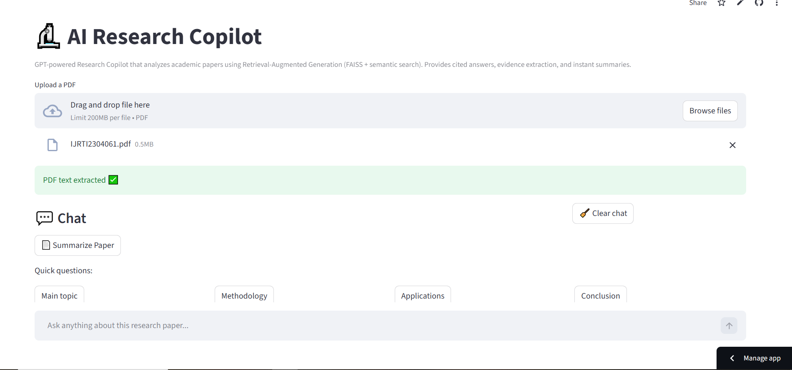

# 🔬 AI Research Copilot (GPT + RAG)

A production-style AI application that allows users to chat with research papers using Retrieval-Augmented Generation (RAG), semantic search, and OpenAI GPT models.

Built to simulate how modern AI research assistants work — providing cited answers, evidence extraction, and intelligent summaries.

---

## 🚀 Live Demo
👉 https://ai-research-copilot-i6x8tcmwuyue78e5hacgkw.streamlit.app/

---

## ⭐ Features

✅ Chat with any research paper  
✅ GPT-powered answers with citations  
✅ Semantic search using FAISS  
✅ Evidence extraction from source text  
✅ Streaming responses (real-time typing)  
✅ Academic-style summaries  
✅ Clean conversational UI  
✅ Local fallback QA model  

---

## 🧠 Tech Stack

**Frontend**
- Streamlit

**AI / NLP**
- OpenAI GPT
- Sentence Transformers
- FAISS Vector Database
- Retrieval-Augmented Generation (RAG)

**Backend**
- Python

---

## ⚙️ How It Works

1. Upload a research paper (PDF)
2. Text is chunked and converted into embeddings
3. FAISS retrieves the most relevant sections
4. GPT generates answers grounded in the retrieved context
5. Sources are displayed for transparency

---

## 📸 Preview

---

## 🔮 Upcoming Features

- 🌍 Multi-language support  
- 📄 Multi-PDF chat  
- ⬇️ Export chat  
- 🔗 Clickable source navigation  
- 🧠 Auto-language detection  

---

## 💡 Why I Built This

Modern AI systems are shifting from pure generation to retrieval-based intelligence.

This project demonstrates how production-grade AI assistants are built using RAG pipelines — combining semantic search with large language models to produce accurate, explainable outputs.

---

## 👨‍💻 Author

**Ali Haidar**

AI / Data Science Enthusiast  
Focused on building real-world AI systems.

---
